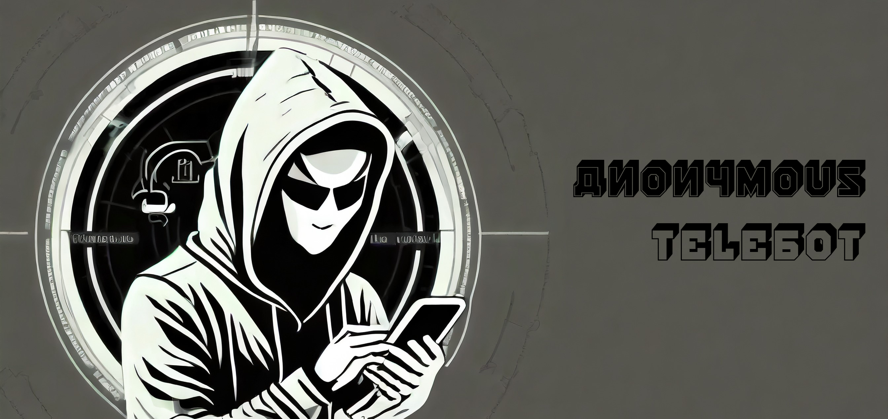

## Introduction

Anonymous Telebot is first and foremost a proof-of-concept python script. Where did I get this (possibly bad) idea? Telegram is very secure. Anonymity is the basis of this application. However, if you don't configure the application, other users can see your nametag (and even your phone number, etc.). And if they have your nametag, they can communicate with you. Let's face it, this is an extremely rare situation. But even if it is rare, I'm sure you'll have enough ideas to imagine all the things you can do with my Telegram bot. So what does it do?

As soon as you enter this Telegram bot, you're asked for a password. The password is set by the bot owner. If you know the password, you can log in and experience total anonymity. You'll be given an atitled name (e.g. USER1). You can then send messages through the Telegram bot to other bot users without knowing their Telegram ID, nametag or anything else. You can also send photos and videos. Note that if USER1 sends a message to USER2, only these 2 users will see the messages, not the others. This bot allows you to have totally private and anonymous conversions. 

Another point that seemed essential to me was not to retrieve any information. That's why users have "USER" IDs and no information or IDs are stored. Everything is saved as a variable, which means that if the script crashes, all users are lost. 

Personally, I've used it to play a kind of "hide-and-seek" game. I sent the password to lots of friends and the aim was to find out who was which user. 

## Features

Common:
- Send messages, photos, videos from one USER to another
- Display list of USERS
- Report a user

For USERS:
- Delete your USER at any time

For OWNER:
- Password-restricted access to the Telebot
- Password can be changed via bot.
- Ability to see users trying to log in, those who have logged in and those who have been banned (function only available for security reasons).
- Possibility of banning a user

## My Anonymous Telebot for test

An example is worth 1,000 words: [Anonymous Telebot](https://t.me/keepthesecret_bot)

1. Connect to [Anonymous Telebot](https://t.me/keepthesecret_bot):
   - A welcome message is sent to you, asking for a password.
2. Send the password: AnonymousTelebot@
3. You have access to the chat ! :)

## How to use (For USER)

List of users:
- ``/users``

To send a message to someone (e.g. USER1):
- ``/USER1 Hello World``

To chat with the bot owner:
- ``/USEROWNER Hello world``

To display help in the bot:
- ``/help``

To delete your user:
- ``/delete_account``

To sign a user:
- ``/REPORT``

## How to use (For OWNER)

The same functions are available as for USERS.

If you want to create your own Anonymous Telebot, please refer to the "Create your own Anonymous Telebot" section. Here we'll look at the actions available to Telegram bot owners.

If you have forgotten your password:
- ``/password``

To change the password (e.g. HELLOWORLD):
- ``/setpassword HELLOWORLD``

To ban a user (e.g. USER1):
- ``/DEL /USER1``

As OWNER and for security reasons, I allow the OWNER to see which users are trying to log in, which have used the correct password and which have been banned.

List of users trying to connect: 
- ``/waiting``

List of users who have used the correct password:
- ``/verified``

List of banned users:
- ``/banned``

## Create your own Anonymous Telebot
1. Install [Telepot](https://github.com/nickoala/telepot):
    ```
    pip install telepot
    ```
    (For Raspberry only) Install [gpiozero](https://gpiozero.readthedocs.io/en/latest/):
    ```
    pip install gpiozero
    ```
2. Extract ```anonymoustelebot.zip``` where you want → [Release](https://github.com/Jumitti/Anonymous_Telebot/releases/tag/v1.0)
   - (For Raspberry) Don't forget to give all permissions at ```anonymoustelebot``` folder:
     - In ```anonymoustelebot``` folder, open a terminal:
     ```
     sudo 777 anonymous_telebot.py
     sudo 777 SECRETS.json
     ```
3. Config ```SECRETS.json``` in ```anonymoustelebot``` folder

   - How to get your **ID_OWNER**:
     - send ```/getid``` to [myidbot](https://telegram.me/myidbot) on [Telegram](https://web.telegram.org/k/)
     - Copy/paste your ID in ```SECRETS.json``` without (') or (")
   
   - How to get your **TOKEN**:
     - Config a bot with [@BotFather](https://telegram.me/BotFather):
       - Create a bot with ```/newbot``` and follow instructions
       - Get API token with ```/mybots```, select your bot and get API token
       - Copy/paste your token in ```SECRETS.json``` between (') or (")
     - Don't forget to send ```/start``` at your Telegram bot

   - **ID** is the list of ID whitelisted

   - **password** is the password to get access to the Telegrambot
4. Run ```anonymous_telebot.py```:
   - In ```anonymoustelebot``` folder, open a terminal:
     ```
     python3 anonymous_telebot.py
     ```
5. That all folks ! You can talk with you Anonymous Telebot 🎉

*Note: If you stop the script, all USERS will disappear.*

## DISCLAIMER: USE OF ANONYMOUS TELEGRAM BOT

1. The user acknowledges and agrees that the use of the Telegram Bot is entirely at their own risk. The operator of the Telegram Bot does not guarantee the accuracy, relevance, completeness, or quality of the information provided.

2. The operator of the Telegram Bot disclaims any responsibility for any harm, loss, or damage, whether direct, indirect, consequential, or otherwise, arising from the use or inability to use the Telegram Bot.

3. The user is solely responsible for the use of the Telegram Bot and must comply with all applicable laws, rules, and regulations. The operator of the Telegram Bot assumes no liability for illegal or unauthorized use.

4. The operator of the Telegram Bot reserves the right to modify, suspend, or discontinue the service at any time, without notice or liability.

By using the Telegram Bot, the user acknowledges having read, understood, and accepted the terms of this disclaimer. Continued use of the Telegram Bot constitutes ongoing acceptance of the terms of this disclaimer.

## Credit & Licence

Copyright (c) 2023 [Minniti Julien](https://github.com/Jumitti).

This software is distributed under an MIT licence. Please consult the LICENSE file for more details.
